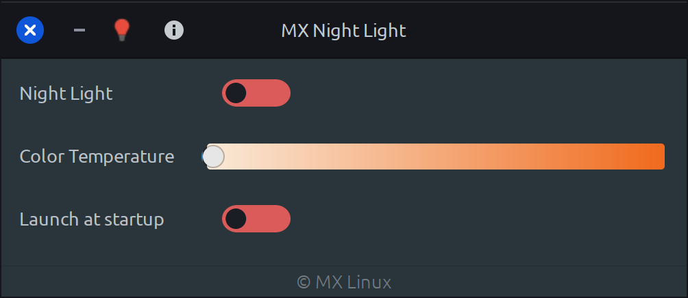

# MX Night Light

MX Night Light is a night light application based on redshift. (fork of pardus-night-light)

Redshift adjusts the color temperature of your screen according to your surroundings.This may help your eyes hurt less if you are working in front of the screen at night.

### **Dependencies**

This application is developed based on Python3 and GTK+ 3. Dependencies:
```bash
gir1.2-ayatanaappindicator3-0.1 gir1.2-glib-2.0 gir1.2-gtk-3.0 redshift
```

### **Run Application from Source**

Install dependencies
```bash
sudo apt install gir1.2-ayatanaappindicator3-0.1 gir1.2-glib-2.0 gir1.2-gtk-3.0 redshift
```

Clone the repository
```bash
git clone https://github.com/DevuboxLinux/mx-night-light.git ~/mx-night-light
```

Run application
```bash
python3 ~/mx-night-light/src/Main.py
```


### **Native GCC build (lighter runtime)**

A native helper binary is included in `native/mx-night-light-native.c` so the core night-light actions can run without starting Python.

Build with GCC:
```bash
cd native
make
```

Install locally:
```bash
sudo make install
```

Examples:
```bash
mx-night-light-native --set 1 --temp 4000
mx-night-light-native --color 3200
mx-night-light-native --set 0
mx-night-light-native --autostart 1
mx-night-light-native --print-config
```

### **Build deb package**

```bash
sudo apt install devscripts git-buildpackage
sudo mk-build-deps -ir
gbp buildpackage --git-export-dir=/tmp/build/mx-night-light -us -uc
```

### **Screenshots**


